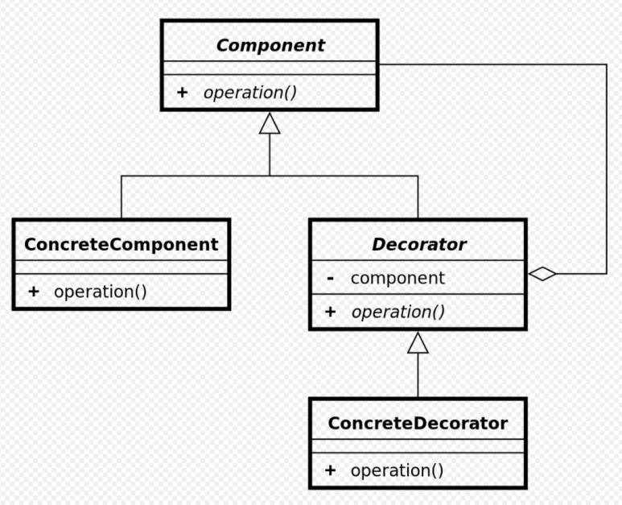

### What is Decorator Pattern?

데코레이터 패턴은 대상 객체에 대한 기능 확장이나 변경이 필요할때 객체의 결합을 통해 서브 클래싱 대신에 쓸 수 있는 유연한 대안 구조 패턴이다.

데코레이터 패턴을 이용하면 런타임에서 동적으로 추가 기능의 조합으로 생성할 수 있다.



- Component: 원본 객체와 장식된 객체 모두를 묶는 역할
- ConcreteComponent: 원본 객체, (데코레이팅 할 객체)
- Decorator: 추상화된 장식자 클래스, 원본 객체를 형성한 필드와 인터페이스의 구현 메서드를 들고 있다
- ConcreteDecorator: 부모클래스가 감싸고 있는 하나의 Component를 호출하면서 호출 전/후로 부가적인 로직을 추가할 수 있음

```java
public interface Weapon { // Component
    void aimAndFire();
}
```

```java
public class BaseWeapon implements Weapon{ // ConcreteComponent
    @Override
    public void aimAndFire() {
        System.out.println("총알 발사");
    }
}
```

```java
public abstract class WeaponAccessory implements Weapon { // Decorator
    private Weapon rifle;

    public WeaponAccessory(Weapon rifle) {
        this.rifle = rifle;
    }

    @Override
    public void aimAndFire() {
        rifle.aimAndFire();
    }
}
```

```java
public class Generate extends WeaponAccessory { // ConcreteDecorator
    public Generate(Weapon rifle) {
        super(rifle);
    }

    @Override
    public void aimAndFire() {
        super.aimAndFire();
        generateFire();
    }

    private void generateFire() {
        System.out.println("유탄 발사");
    }
}
```

```java
public class Scoped extends WeaponAccessory {

    public Scoped(Weapon rifle) {
        super(rifle);
    }

    @Override
    public void aimAndFire() {
        aiming();
        super.aimAndFire();
    }

    private void aiming() {
        System.out.println("조준 중..");
    }
}

```

```java
Weapon rifle = new BaseWeapon();

Weapon decorated = new Scoped(new Generate(rifle));

decorated.aimAndFire();

조준 중..
총알 발사
유탄 발사
의 결과를 만들 수 있다
```

### Reference

- https://inpa.tistory.com/entry/GOF-%F0%9F%92%A0-%EB%8D%B0%EC%BD%94%EB%A0%88%EC%9D%B4%ED%84%B0Decorator-%ED%8C%A8%ED%84%B4-%EC%A0%9C%EB%8C%80%EB%A1%9C-%EB%B0%B0%EC%9B%8C%EB%B3%B4%EC%9E%90
