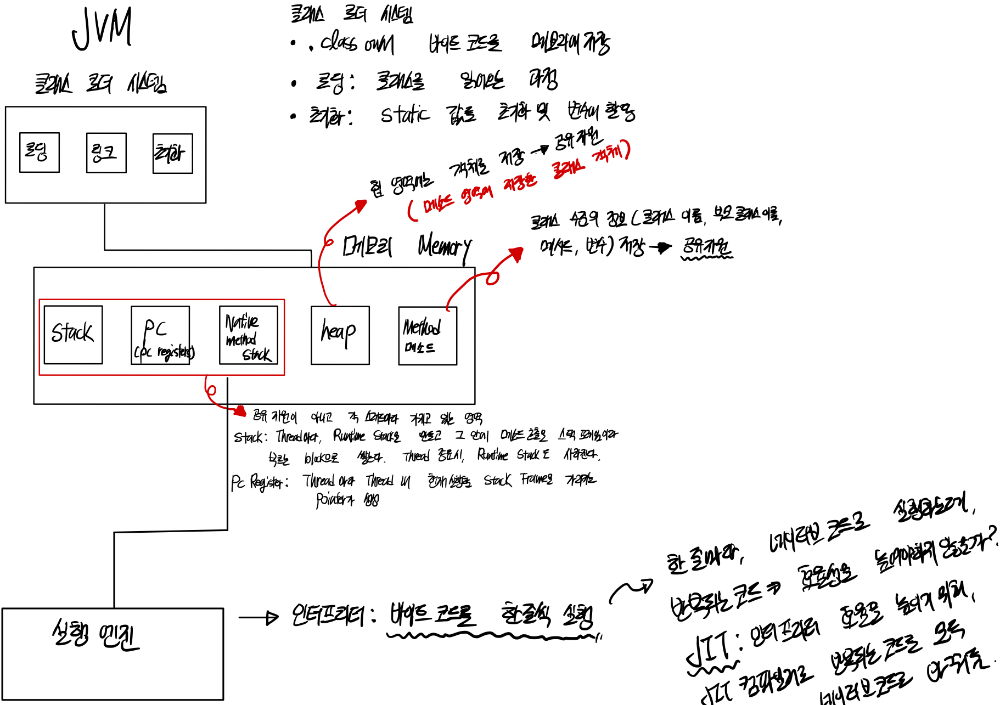

# Java에서 놓치고 있는 개념 정리하기

(출처: 인프런 강의 - 더 자바, 코드를 조작하는 다양한 방법)

### JVM의 역할



- 자바 가상 머신으로 자바 바이트 코드를 OS에 특화된 코드로 변환하여 실행합니다. 따라서 특정 플랫폼에 종속적입니다
- 우리가 HelloJava.java를 만들었을때 컴파일 하면 class 파일이 생성되는데 class 파일에 들어있는 것이 바이트 코드입니다.
  그 이후에 JIT과 인터프리터를 통해 실행됨
- 바이트 코드를 실행하는 표준이자 구현체이다.

JVM은 JVM 홀로 제공되지 않습니다.
최소한의 단위가 바로 JRE입니다. Java Runtime Envrionment

- JVM과 Library를 함께 제공하는데, JRE는 자바 **애플리케이션을 실행**할 수 있도록 구성된 배포판
- JVM과 핵심 라이브러리 및 자바 런타임 환경에서 사용하는 프로퍼티 세팅이나 리소스 파일을 가지고 있음
- 개발 관련 도구는 포함하지 않음

JDK(Java Development Kit)

- JRE + 개발에 필요한 툴
- 소스 코드를 작성할 때 사용하는 자바 언어는 플랫폼에 독립적이다
- 오라클은 Java 11부터 JDK만 제공하며 JRE를 따로 제공하지 않음

Java

- 프로그래밍 언어
- JDK에 들어있는 자바 컴파일러(javac)를 사용하여 바이트코드(.class 파일)로 컴파일할 수 있다.

타 프로그래밍 언어 지원

- Kotlin, Scala ...

### 클래스 로더

- 로딩, 링크, 초기화 순으로 진행된다.
- 로딩

  - 클래스 로더가 .class 파일을 읽고 그 내용에 따라 적절한 바이너리 데이터를 만들고 "메소드 영역"에 저장
  - 이때 메소드 영역에 저장하는 데이터는 FQCN(Full Qualifed Class Name), class | interface | enum, method와 변수를 저장
  - 로딩이 끝나면 해당 클래스 타입의 Class 객체를 생성하여 "힙" 영역에 저장

- 링크

  - Verify, Prepare, Resolve 세 단계로 나뉘어짐
  - 검증: .class 파일 형식이 유효한지 체크함
  - Preparation: 클래스 변수와 기본값에 필요한 메모리 레퍼런스를 메소드 영역에 있는 실제 레퍼런스로 교체함
  - Resolve: 심볼릭 메모리 레퍼런스를 메소드 영역에 있는 실제 레퍼런스로 교체함

- 초기화
  - Static 변수의 값을 할당함 (static 블럭이 있다면 이때 실행됨)
- 클래스 로더는 계층 구조로 이루어져 있으면서 기본적으로 세가지 클래스 로더가 제공됨 즉, 부모 클래스가 존재함

### 아무것도 없는 모자에서 토끼를 꺼내는 마술

- 바이트코드 조작 라이브러리
  - ASM
  - Javassist
  - ByteBuddy

바이트 코드를 조작해서 조작한 결과물을 보여줄 수 있다.

### Spring ASM이란

ASM 모듈은 클래스 바이트코드 조작 및 분석 프레임워크인 ASM을 재 패키징한 모듈

### 바이트코드 조작

프로그램 분석

- 코드에서 버그 찾는 툴
- 코드 복잡도 계산

클래스 파일 생성

- 프록시
- 특정 API 호출 접근 제한
- 스칼라 같은 언어의 컴파일러

그밖에도 자바 소스 코드 건드리지 않고 코드 변경이 필요한 여러 경우에 사용할 수 있다.

- 프로파일러
- 최적화
- 로깅

## Reflection

클래스 로딩이 끝나면 위에서 클래스 타입의 인스턴스를 Heap에 넣어준다고 이야기 했었다.

- 필드나 메서드들을 가져올 수 있음
- 접근제어자가 private이어도 접근 가능
- isPrivate, isPublic 등등 조회가 가능
- Modifier가 제공하는 것을 통해 할 수 있음
- method의 paramter, return type 등등 알 수 있음

### Reflection API

리플렉션의 시작은 Class<T>

- 모든 클래스는 클래스 로더를 통해 로딩 과정을 거친 후, 힙 영역에 Class<T>의 인스턴스가 생김
  "타입.class"로 접근할 수 있음
- 모든 인스턴스는 getClass() 메소드를 가지고 있음
- 클래스를 문자열로 읽어오는 방법
  - Class.forName("FQCN") -> Full Qualified ClassName
  - Class Path에 해당 클래스가 없으면 ClassNotFoundException 발생

**리플렉션 사용시 주의할 것**

- 지나친 사용은 성능 이슈를 야기할 수 있음
- 컴파일 타임에 확인되지 않고 런타임 시에만 발생하는 문제를 만들 가능성이 있음
- 접근 지시자를 무시할 수 있음

Spring에서는 의존성 주입이나 MVC 뷰에서 넘어온 데이터를 객체에 바인딩 할 때
하이버네이트에서는 @Entity 클래스에 Setter가 없다면 Reflection을 사용함

### Annotation 과 Reflection

- 애노테이션을 만들고 임의의 클래스(Book.class)에 애노테이션을 사용했을때 Book.class.getAnnotations()를 해서 출력해보면 아무것도 출력하지 않는다. Why?

  - Retention으로 Runtime을 지정해주지 않는다면, 해당 java 파일이 바이트 코드로 변환될때 참고하고 있지 않음

### Reflection을 활용한 적극적인 활용

```Java
public class Book {
  public static String A = "A";
  private String B = "B";

  public Book() {}

  public Book(String b) {
    B = b;
  }

  public void c() {
    System.out.println("C");
  }

  public int sum(int left, int right) {
    return left + right;
  }
}
```

```Java
public static void main(String[] args) {
  Class<?> bookClass = Class.forName("taeyong.Book");
  Constructor<?> constructor = bookClass.getConstructor(String.class);
  Book book = (Book) constructor.newInstance("myBook"); // String value가 필요한 생성자

  Field a = Book.class.getDeclaredField("A");
  System.out.println(a.get(null));// null인 이유? a는 static Field기 때문에 인스턴스가 따로 필요 없음
  a.set(null, "AAAAAA");
  System.out.println(a.get(null)); // 값이 바뀜
}
```

### 나만의 DI 프레임워크 만들기

@Inject 라는 애노테이션 만들어서 필드 주입 해주는 컨테이너 서비스 만들기

```Java
public class BookService {
  @Inject
  BookRepository bookRepository;
}


ContainerService.java
public static <T> getObject(T classType)
```

애노테이션을 활용한 DI가 Reflection을 통해 주입해주는 과정을 만들 수 있다.

## Spring Data JPA

Repository를 사용할때 interface로 선언한 repository가 어떻게 빈이 주입이 되는지 궁금할 것이다.

그 기술의 원천은 Spring AOP의 기술인 Proxy를 활용하여 진행되어 있다.
Spring Data JPA는 결국 로우 단계에서 InvocationHandler를 활용하고 있다.

확인할 수 있는 방법은

- ProxyFactory는 다이나믹 프록시의 추상화된 것
- RepositoryFactorySupport에서 프록시를 생성한다.

`Proxy Pattern이 왜 탄생했을까에 대해 고민할 필요가 있다.`

- SRP를 떠올리면 좋을 것

* Proxy Pattern을 Dynamic Proxy를 이용한 방법으로 사용하지 않다보면 인터페이스의 추가되는 메서드마다 대응을 해야 하고, 프록시가 프록시를 감싸는 케이스, 코드의 중복들이 일어날 수 있다.

따라서 Reflection을 활용한 Dynamic Proxy방법을 확인해보자

```Java
public class BookServiceTest {
  BookService bookService = (BookService) Proxy.newProxyInstance(BookService.class.getClassLoader(), new Class[]{BookService.class}, new InvocationHandler() {
    @Override
    public Object invoke(Object proxy, Method method, Object[] args) throws Throwable {
      if(method.getName().equals("rent")) {
        System.out.println("aaaa");
        Object invoke = method.invoke(bookService, args);
        System.out.println("bbbb");
        return invoke;
      }

      return method.invoke(bookService, args);
    }
  });
}
```

`위와 같이 ProxyInstance를 활용해서 Dynamic하게 할 수 있는데 유연한 구조는 아니다`

따라서, AOP를 더 자세히 알기 위해서는 토비의 스프링 AOP를 참고!

BookService가 interface가 아니라면? Interface만을 지원하기 때문에 Proxy를 생성할 수가 없다.

따라서 클래스의 프록시가 필요하다면?

서브 클래스를 만들 수 있는 라이브러리를 사용하여 프록시를 만들 수 있습니다.

**CGlib**

- 스프링, 하이버네이트가 사용하는 라이브러리

Enhancer를 가지고 create할 수 있음
하지만 handler를 만들어서 넘겨줘야함

```Java
MethodInterceptor handler = new MethodInterceptor() {
  BookService bookService = new BookService();
  @Override
  public Object intercept(Object o, Method method, Object[] args, MethodProxy methodProxy) throws Throwable {
    ...
  }
}

BookService bookSerivce = (BookService) Enhancer.create(BookService.class, handler);
```

**ByteBuddy**

- ByteBuddy는 Spring에서 Version 관리를 해주고 있음

ByteBuddy나 CGLib 모두 상속을 지원하지 않는 클래스라면
Ex) final class, 생성자가 private한 생성자만 존재할 경우
클래스 타입의 프록시를 생성할 수 없다.

따라서, interface를 만들어서 사용하는 것이 좋을 것이다.

런타임이 아닌, 컴파일 때 소스 코드의 변경을 만들 수 있는 방법도 있는데
해당 방법은 다른 파일에서 확인해보겠습니다.
